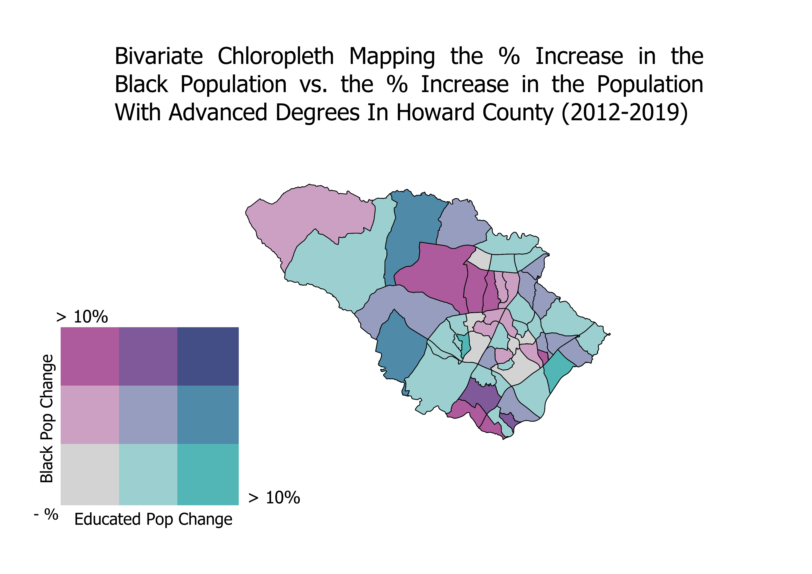

# *GES LAB 6 Assingment*

## Purpose of Project 
The purpose of this project was to create a chloropleth map measuring the increase in both the Black Population and the population with an advanced degree in Howard County from the years 2012-2019 

## Where is the Data Coming From? 
The data for this project was obtained from ACS 2012 and ACS 2019 data using the tidycensus package in R. The data includes information on the cencus tract level 
regarding the number of Black residents in a census tract and the number of people in that census tract who have an advanced degree. This data was manipulated to create 
variables indicating the percentage of the population that was Black or highly educated. 

## What are the Specified Outputs? 
The outputs for this data consisted of taking the differences between percentage of the population that is black and the percentage of the population that
is highly educated. 

## How Was Data created? 
Data for the chloropleth maps were ceated in 3 steps. The first step involved obtaining the raw demographic data on race and education from the ACS survey. Once this was done, a full table join was used in R to combine both maps (2012 map and 2019 map) into 1 table, where the differences in the Black population and educated population were calculated from the specified years. Once these differences were obtained, the tables were transformed into shapefiles that could be uploaded to QGIS in order to be turned into chloropleth maps. 

## R Code 
To view my R Code, click the link below 
<a href="https://github.com/jjustin1/GESLAB6.github.io/blob/main/RNotebook/GES%20LAB%206%20R%20notebook%20PDF.pdf" target="_blank">GES Lab 6 R Notebook.</a>

## Final Output 

